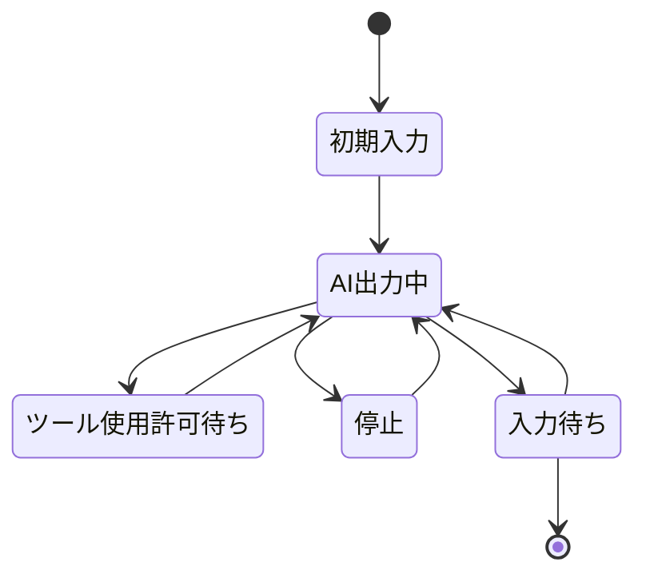

# セッション

## セッションとは
人間とAIとのやり取りを指す

タスクとは1対1の関係にある

## 状態遷移

## 状態詳細

### 初期入力
タスクを実行するために初期入力値が与えられた状態

### AI出力中
AIが実際にタスクを実行している状態

### ツール使用許可待ち
AIが使用に許可が必要ツールを使おうとして、人間の承認を待っている状態
人間が承認、もしくは否認するとAI出力中に遷移する

### 停止
人間が何かしらの理由でAIを停止した状態
人間側の操作をトリガーとして再実行可能で、再実行した際にはAI出力中に遷移する

### 入力待ち
AIの作業が終了し、人間の入力を待っている状態
タスクの状態に応じて、セッションが終了する場合もある