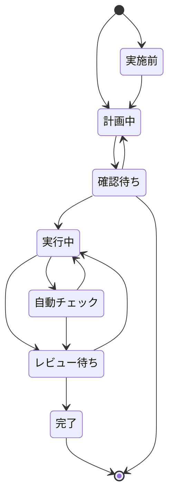

# タスク

## タスクとは

人間がエージェントに指示をし、会話をしながら目的を達成するまでの一連の流れを指す

## 状態遷移

## 状態詳細

### 実施前

指示を入力しただけの状態
人間が計画中に遷移するか決定する

### 計画中

エージェントをplanモードで実行中

### 確認待ち

エージェントがplanモードで実行が完了した状態
人間が再度計画中に移行するのか、実行中に移行にするか決定する

### 実行中

エージェントをactモードで実行中

## 自動チェック

ユーザーが事前に設定した受け入れチェック処理を実行中
チェックに失敗したらチェック内容をエージェントにフィードバックし、実行中に遷移
チェックに成功したらレビュー待ちに遷移

### レビュー待ち

人間の承認待ち
目的が達成できていない場合は人間が実行中に戻す

### 完了

目的が達成した状態
